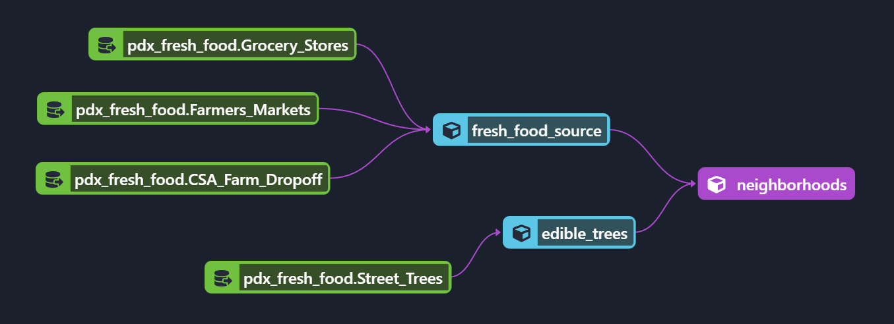

 ## DBT ELT PDX Fresh Food

#### by Jess Schueler

### Technologies Used
* DBT
* SQL

### Description 
A DBT E(T)LT pipeline, that intakes four seperate datasets obtained from the [City of Portland Open Data](https://gis-pdx.opendata.arcgis.com/]).There are four source tables used, a list of grocery stores, farmer's markets, CSA farm dropoff locations, and street trees in the city of Portland. The disparate data sets made this sligtly challenging to work with, and some pre-cleaning needed to be done before they were stored in Google BigQuery, including using the Google Maps API to retrieve neighborhood data. While these datasets are still imperfect, and lacking in nuance such as the accessibility of these food sources, this data could be helpful in the classification of food deserts in the city of Portland, as well as analysis on what neighborhoods have plentiful and consistent access to fresh foods. 

### Known Bugs
* none at this time

### License
MIT

Copyright (c) 7/15/22 Jess Schueler
